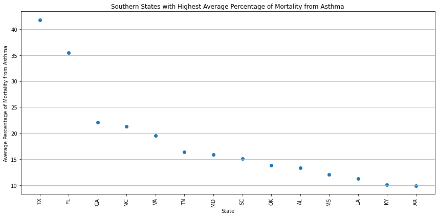
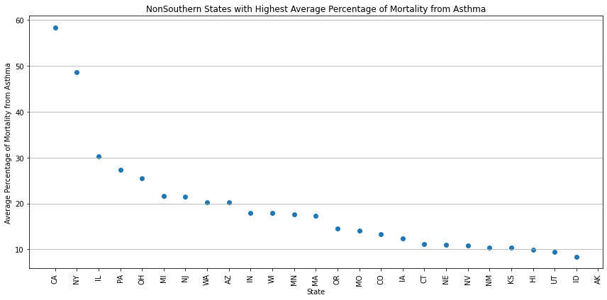
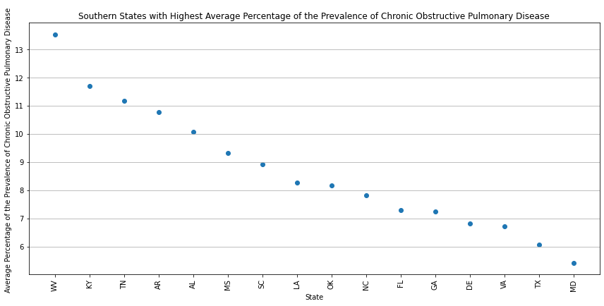
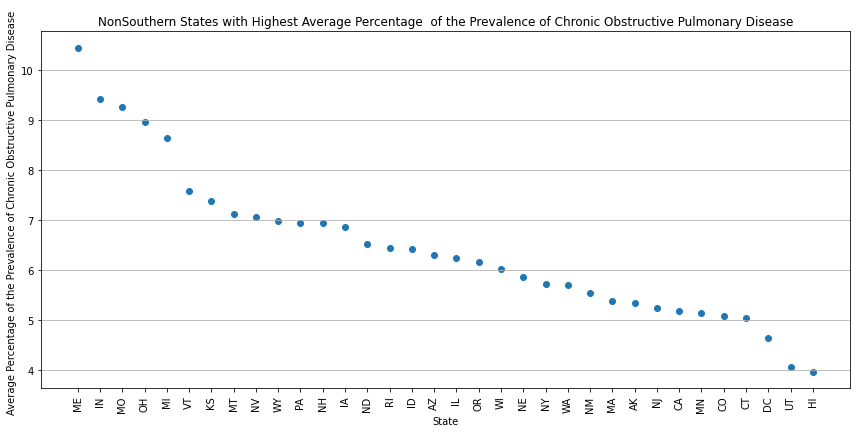

# Do Southern states tend to have higher asthma and chronic obstructive pulmonary disorder rates? #

## Introduction ##

As a Southern American, I have noticed that many of my peers tend to have either asthma or other chronic obstructive pulmonary disorders. This, along with a theory that African Americans tend to have higher rates of these issues made me wonder is this a geological concern? It also made me wonder if it could also simply be environmental. Thus, I hypothesize that Southern states tend to have higher asthma and chronic obstructive pulmonary disorder rates.

## Methodology ##

I am using data colleged by the CDC. A full description can be seen [here](#description), directly below. For my analysis, I consider Alabama, Arkansas, Delaware, Florida, Georgia, Kentucky, Louisiana, Maryland, Mississippi, North Carolina, Oklahoma, South Carolina, Tennessee, Texas, Virginia, and West Virginia to be the Southern states. This is a limitation, as I went based on the mason-dixon line and did not do a breakdown of the other regions of the United States. I then used scatter plots to visualize my data. My setup for the analysis begins [here](#cleaning).

### Data Description  <a id='description'></a>
**United States Chronic disease Indicators** <br>
Last Updated: March 9, 2024 <br>
https://catalog.data.gov/dataset/u-s-chronic-disease-indicators <br>
Population Health provides a cross-cutting set of 115 indicators developed by consensus among CDC, the Council of State and Territorial Epidemiologists, and the National Association of Chronic Disease Directors. These indicators allow states and territories to uniformly define, collect, and report chronic disease data important to public health practice in their area. In addition to providing access to state-specific indicator data, the CDI website is a gateway to additional information and data resources.

## Analysis ##

### Asthma ###

I analyzed the average mortality rate caused by asthma amongst U.S. adults. I found that most of the Southern states had an average mortality rate less than 25%, except for Florida and Texas. Those states both had rates higher than 35%. This was similar to the rest of the states, where most were also less than 25%, with California and New York being outliers. This can likely be attributed to higher pollution levels in these states due to industry and higher pollution. Most of the states with a higher asthma moraltily rate amongst adults are known for their industry. While, the lower rates are known for being more rural, such as Utah and Idaho. My full analysis and coding for it can be seen [here](#asthma).

### Chronic obstructive pulmonary disorders ###

I also analyzed the average percentage of the prevalence of chronic obstructive pulmonary disease (COPD). Most of the Southern states, except for Maryland, had an average prevalence between 6% and 15%. This was different from the rest of the states, where around half of them were within that rate but the other half were under 6%, with a maximum of about 13%. Due to most of the Southern region having a higher COPD prevalence, this does indicate that the Southern region dbid tend to have higher COPD rates. It is also interesting to note that three of the highest Southern rates: West Virgina, Kentucky, and Tennesee respectively are along the mason-dixon line. While some of the lower states tended to be more mixed in geological location. My full analysis and coding for it can be seen [here](#copd).

## Recommendation ##

I recommmend that individuals that live in the United States check their air quality often and try to relocate to areas with less air quality issues, especially in states such as California, New York, Florida, and Texas and those along the mason-dixon line. If this is not possible, they take should precautions like masking when outside and using air purifiers when indoors and try to avoid being in unfiltered air as often as possible. 

### Code <a id='cleaning'></a>
#### Examining the dataset ####


```python
# Import libraries
import numpy as np                  
import pandas as pd                 
import matplotlib.pyplot as plt     
import seaborn as sns               

# Let's make sure pandas returns all the rows and columns for the dataframe
pd.set_option('display.max_rows', None)
pd.set_option('display.max_columns', None)

# Force pandas to display full numbers instead of scientific notation
#pd.options.display.float_format = '{:.0f}'.format

# Library to suppress warnings
import warnings
warnings.filterwarnings('ignore')
```


```python
#Read the dataset
path = pd.read_csv('/Users/jana/Documents/GitHub/intro-to-data-analytics/Assignments/Assignment 1/U.S._Chronic_Disease_Indicators.csv')

#Create df
cdi = pd.DataFrame(path)
```

#### Understanding the dataset ####


```python
# Check the first 10 rows
cdi.head(10)
```


<div>
<style scoped>
    .dataframe tbody tr th:only-of-type {
        vertical-align: middle;
    }

    .dataframe tbody tr th {
        vertical-align: top;
    }

    .dataframe thead th {
        text-align: right;
    }
</style>
<table border="1" class="dataframe">
  <thead>
    <tr style="text-align: right;">
      <th></th>
      <th>YearStart</th>
      <th>YearEnd</th>
      <th>LocationAbbr</th>
      <th>LocationDesc</th>
      <th>DataSource</th>
      <th>Topic</th>
      <th>Question</th>
      <th>Response</th>
      <th>DataValueUnit</th>
      <th>DataValueType</th>
      <th>DataValue</th>
      <th>DataValueAlt</th>
      <th>DataValueFootnoteSymbol</th>
      <th>DataValueFootnote</th>
      <th>LowConfidenceLimit</th>
      <th>HighConfidenceLimit</th>
      <th>StratificationCategory1</th>
      <th>Stratification1</th>
      <th>StratificationCategory2</th>
      <th>Stratification2</th>
      <th>StratificationCategory3</th>
      <th>Stratification3</th>
      <th>Geolocation</th>
      <th>LocationID</th>
      <th>TopicID</th>
      <th>QuestionID</th>
      <th>ResponseID</th>
      <th>DataValueTypeID</th>
      <th>StratificationCategoryID1</th>
      <th>StratificationID1</th>
      <th>StratificationCategoryID2</th>
      <th>StratificationID2</th>
      <th>StratificationCategoryID3</th>
      <th>StratificationID3</th>
    </tr>
  </thead>
  <tbody>
    <tr>
      <th>0</th>
      <td>2019</td>
      <td>2019</td>
      <td>GA</td>
      <td>Georgia</td>
      <td>BRFSS</td>
      <td>Disability</td>
      <td>Adults with any disability</td>
      <td>NaN</td>
      <td>%</td>
      <td>Crude Prevalence</td>
      <td>44.0</td>
      <td>44.0</td>
      <td>NaN</td>
      <td>NaN</td>
      <td>41.0</td>
      <td>47.1</td>
      <td>Age</td>
      <td>Age &gt;=65</td>
      <td>NaN</td>
      <td>NaN</td>
      <td>NaN</td>
      <td>NaN</td>
      <td>POINT (-83.62758034599966 32.83968109300048)</td>
      <td>13</td>
      <td>DIS</td>
      <td>DIS01</td>
      <td>NaN</td>
      <td>CRDPREV</td>
      <td>AGE</td>
      <td>AGE65P</td>
      <td>NaN</td>
      <td>NaN</td>
      <td>NaN</td>
      <td>NaN</td>
    </tr>
    <tr>
      <th>1</th>
      <td>2019</td>
      <td>2019</td>
      <td>GU</td>
      <td>Guam</td>
      <td>BRFSS</td>
      <td>Arthritis</td>
      <td>Arthritis among adults</td>
      <td>NaN</td>
      <td>%</td>
      <td>Crude Prevalence</td>
      <td>15.9</td>
      <td>15.9</td>
      <td>NaN</td>
      <td>NaN</td>
      <td>13.3</td>
      <td>18.9</td>
      <td>Sex</td>
      <td>Female</td>
      <td>NaN</td>
      <td>NaN</td>
      <td>NaN</td>
      <td>NaN</td>
      <td>POINT (144.793731 13.444304)</td>
      <td>66</td>
      <td>ART</td>
      <td>ART01</td>
      <td>NaN</td>
      <td>CRDPREV</td>
      <td>SEX</td>
      <td>SEXF</td>
      <td>NaN</td>
      <td>NaN</td>
      <td>NaN</td>
      <td>NaN</td>
    </tr>
    <tr>
      <th>2</th>
      <td>2019</td>
      <td>2019</td>
      <td>GU</td>
      <td>Guam</td>
      <td>BRFSS</td>
      <td>Immunization</td>
      <td>Influenza vaccination among adults</td>
      <td>NaN</td>
      <td>%</td>
      <td>Crude Prevalence</td>
      <td>30.0</td>
      <td>30.0</td>
      <td>NaN</td>
      <td>NaN</td>
      <td>26.2</td>
      <td>34.0</td>
      <td>Sex</td>
      <td>Male</td>
      <td>NaN</td>
      <td>NaN</td>
      <td>NaN</td>
      <td>NaN</td>
      <td>POINT (144.793731 13.444304)</td>
      <td>66</td>
      <td>IMM</td>
      <td>IMM01</td>
      <td>NaN</td>
      <td>CRDPREV</td>
      <td>SEX</td>
      <td>SEXM</td>
      <td>NaN</td>
      <td>NaN</td>
      <td>NaN</td>
      <td>NaN</td>
    </tr>
    <tr>
      <th>3</th>
      <td>2019</td>
      <td>2019</td>
      <td>ME</td>
      <td>Maine</td>
      <td>BRFSS</td>
      <td>Diabetes</td>
      <td>Diabetes among adults</td>
      <td>NaN</td>
      <td>%</td>
      <td>Crude Prevalence</td>
      <td>11.4</td>
      <td>11.4</td>
      <td>NaN</td>
      <td>NaN</td>
      <td>10.2</td>
      <td>12.7</td>
      <td>Sex</td>
      <td>Male</td>
      <td>NaN</td>
      <td>NaN</td>
      <td>NaN</td>
      <td>NaN</td>
      <td>POINT (-68.98503133599962 45.254228894000505)</td>
      <td>23</td>
      <td>DIA</td>
      <td>DIA01</td>
      <td>NaN</td>
      <td>CRDPREV</td>
      <td>SEX</td>
      <td>SEXM</td>
      <td>NaN</td>
      <td>NaN</td>
      <td>NaN</td>
      <td>NaN</td>
    </tr>
    <tr>
      <th>4</th>
      <td>2019</td>
      <td>2019</td>
      <td>NV</td>
      <td>Nevada</td>
      <td>NVSS</td>
      <td>Health Status</td>
      <td>Life expectancy at birth</td>
      <td>NaN</td>
      <td>Years</td>
      <td>Number</td>
      <td>78.0</td>
      <td>78.0</td>
      <td>NaN</td>
      <td>NaN</td>
      <td>77.8</td>
      <td>78.2</td>
      <td>Overall</td>
      <td>Overall</td>
      <td>NaN</td>
      <td>NaN</td>
      <td>NaN</td>
      <td>NaN</td>
      <td>POINT (-117.07184056399967 39.493240390000494)</td>
      <td>32</td>
      <td>HEA</td>
      <td>HEA06</td>
      <td>NaN</td>
      <td>NMBR</td>
      <td>OVERALL</td>
      <td>OVR</td>
      <td>NaN</td>
      <td>NaN</td>
      <td>NaN</td>
      <td>NaN</td>
    </tr>
    <tr>
      <th>5</th>
      <td>2019</td>
      <td>2019</td>
      <td>OH</td>
      <td>Ohio</td>
      <td>BRFSS</td>
      <td>Arthritis</td>
      <td>Arthritis among adults</td>
      <td>NaN</td>
      <td>%</td>
      <td>Crude Prevalence</td>
      <td>51.8</td>
      <td>51.8</td>
      <td>NaN</td>
      <td>NaN</td>
      <td>49.8</td>
      <td>53.7</td>
      <td>Age</td>
      <td>Age &gt;=65</td>
      <td>NaN</td>
      <td>NaN</td>
      <td>NaN</td>
      <td>NaN</td>
      <td>POINT (-82.40426005599966 40.06021014100048)</td>
      <td>39</td>
      <td>ART</td>
      <td>ART01</td>
      <td>NaN</td>
      <td>CRDPREV</td>
      <td>AGE</td>
      <td>AGE65P</td>
      <td>NaN</td>
      <td>NaN</td>
      <td>NaN</td>
      <td>NaN</td>
    </tr>
    <tr>
      <th>6</th>
      <td>2019</td>
      <td>2019</td>
      <td>OK</td>
      <td>Oklahoma</td>
      <td>BRFSS</td>
      <td>Arthritis</td>
      <td>Arthritis among adults</td>
      <td>NaN</td>
      <td>%</td>
      <td>Crude Prevalence</td>
      <td>30.5</td>
      <td>30.5</td>
      <td>NaN</td>
      <td>NaN</td>
      <td>28.7</td>
      <td>32.3</td>
      <td>Sex</td>
      <td>Female</td>
      <td>NaN</td>
      <td>NaN</td>
      <td>NaN</td>
      <td>NaN</td>
      <td>POINT (-97.52107021399968 35.47203135600046)</td>
      <td>40</td>
      <td>ART</td>
      <td>ART01</td>
      <td>NaN</td>
      <td>CRDPREV</td>
      <td>SEX</td>
      <td>SEXF</td>
      <td>NaN</td>
      <td>NaN</td>
      <td>NaN</td>
      <td>NaN</td>
    </tr>
    <tr>
      <th>7</th>
      <td>2019</td>
      <td>2019</td>
      <td>VI</td>
      <td>Virgin Islands</td>
      <td>YRBSS</td>
      <td>Alcohol</td>
      <td>Alcohol use among high school students</td>
      <td>NaN</td>
      <td>%</td>
      <td>Crude Prevalence</td>
      <td>NaN</td>
      <td>NaN</td>
      <td>*</td>
      <td>No data available</td>
      <td>NaN</td>
      <td>NaN</td>
      <td>Sex</td>
      <td>Female</td>
      <td>NaN</td>
      <td>NaN</td>
      <td>NaN</td>
      <td>NaN</td>
      <td>POINT (-64.896335 18.335765)</td>
      <td>78</td>
      <td>ALC</td>
      <td>ALC01</td>
      <td>NaN</td>
      <td>CRDPREV</td>
      <td>SEX</td>
      <td>SEXF</td>
      <td>NaN</td>
      <td>NaN</td>
      <td>NaN</td>
      <td>NaN</td>
    </tr>
    <tr>
      <th>8</th>
      <td>2019</td>
      <td>2019</td>
      <td>WV</td>
      <td>West Virginia</td>
      <td>NVSS</td>
      <td>Health Status</td>
      <td>Life expectancy at birth</td>
      <td>NaN</td>
      <td>Years</td>
      <td>Number</td>
      <td>71.9</td>
      <td>71.9</td>
      <td>NaN</td>
      <td>NaN</td>
      <td>71.6</td>
      <td>72.2</td>
      <td>Sex</td>
      <td>Male</td>
      <td>NaN</td>
      <td>NaN</td>
      <td>NaN</td>
      <td>NaN</td>
      <td>POINT (-80.71264013499967 38.66551020200046)</td>
      <td>54</td>
      <td>HEA</td>
      <td>HEA06</td>
      <td>NaN</td>
      <td>NMBR</td>
      <td>SEX</td>
      <td>SEXM</td>
      <td>NaN</td>
      <td>NaN</td>
      <td>NaN</td>
      <td>NaN</td>
    </tr>
    <tr>
      <th>9</th>
      <td>2020</td>
      <td>2020</td>
      <td>AL</td>
      <td>Alabama</td>
      <td>BRFSS</td>
      <td>Diabetes</td>
      <td>Diabetes among adults</td>
      <td>NaN</td>
      <td>%</td>
      <td>Crude Prevalence</td>
      <td>5.0</td>
      <td>5.0</td>
      <td>NaN</td>
      <td>NaN</td>
      <td>3.6</td>
      <td>6.8</td>
      <td>Age</td>
      <td>Age 18-44</td>
      <td>NaN</td>
      <td>NaN</td>
      <td>NaN</td>
      <td>NaN</td>
      <td>POINT (-86.63186076199969 32.84057112200048)</td>
      <td>1</td>
      <td>DIA</td>
      <td>DIA01</td>
      <td>NaN</td>
      <td>CRDPREV</td>
      <td>AGE</td>
      <td>AGE1844</td>
      <td>NaN</td>
      <td>NaN</td>
      <td>NaN</td>
      <td>NaN</td>
    </tr>
  </tbody>
</table>
</div>


```python
# Check the last 10 rows
cdi.tail(10)
```


<div>
<style scoped>
    .dataframe tbody tr th:only-of-type {
        vertical-align: middle;
    }

    .dataframe tbody tr th {
        vertical-align: top;
    }

    .dataframe thead th {
        text-align: right;
    }
</style>
<table border="1" class="dataframe">
  <thead>
    <tr style="text-align: right;">
      <th></th>
      <th>YearStart</th>
      <th>YearEnd</th>
      <th>LocationAbbr</th>
      <th>LocationDesc</th>
      <th>DataSource</th>
      <th>Topic</th>
      <th>Question</th>
      <th>Response</th>
      <th>DataValueUnit</th>
      <th>DataValueType</th>
      <th>DataValue</th>
      <th>DataValueAlt</th>
      <th>DataValueFootnoteSymbol</th>
      <th>DataValueFootnote</th>
      <th>LowConfidenceLimit</th>
      <th>HighConfidenceLimit</th>
      <th>StratificationCategory1</th>
      <th>Stratification1</th>
      <th>StratificationCategory2</th>
      <th>Stratification2</th>
      <th>StratificationCategory3</th>
      <th>Stratification3</th>
      <th>Geolocation</th>
      <th>LocationID</th>
      <th>TopicID</th>
      <th>QuestionID</th>
      <th>ResponseID</th>
      <th>DataValueTypeID</th>
      <th>StratificationCategoryID1</th>
      <th>StratificationID1</th>
      <th>StratificationCategoryID2</th>
      <th>StratificationID2</th>
      <th>StratificationCategoryID3</th>
      <th>StratificationID3</th>
    </tr>
  </thead>
  <tbody>
    <tr>
      <th>311735</th>
      <td>2022</td>
      <td>2022</td>
      <td>VI</td>
      <td>Virgin Islands</td>
      <td>BRFSS</td>
      <td>Immunization</td>
      <td>Influenza vaccination among adults 18–64 who a...</td>
      <td>NaN</td>
      <td>%</td>
      <td>Age-adjusted Prevalence</td>
      <td>NaN</td>
      <td>NaN</td>
      <td>****</td>
      <td>Data suppressed; denominator &lt; 50 or relative ...</td>
      <td>NaN</td>
      <td>NaN</td>
      <td>Race/Ethnicity</td>
      <td>Multiracial, non-Hispanic</td>
      <td>NaN</td>
      <td>NaN</td>
      <td>NaN</td>
      <td>NaN</td>
      <td>POINT (-64.896335 18.335765)</td>
      <td>78</td>
      <td>IMM</td>
      <td>IMM02</td>
      <td>NaN</td>
      <td>AGEADJPREV</td>
      <td>RACE</td>
      <td>MRC</td>
      <td>NaN</td>
      <td>NaN</td>
      <td>NaN</td>
      <td>NaN</td>
    </tr>
    <tr>
      <th>311736</th>
      <td>2022</td>
      <td>2022</td>
      <td>WA</td>
      <td>Washington</td>
      <td>BRFSS</td>
      <td>Alcohol</td>
      <td>Binge drinking prevalence among adults</td>
      <td>NaN</td>
      <td>%</td>
      <td>Age-adjusted Prevalence</td>
      <td>14.3</td>
      <td>14.3</td>
      <td>NaN</td>
      <td>NaN</td>
      <td>9.4</td>
      <td>21.1</td>
      <td>Race/Ethnicity</td>
      <td>American Indian or Alaska Native, non-Hispanic</td>
      <td>NaN</td>
      <td>NaN</td>
      <td>NaN</td>
      <td>NaN</td>
      <td>POINT (-120.47001078999972 47.52227862900048)</td>
      <td>53</td>
      <td>ALC</td>
      <td>ALC06</td>
      <td>NaN</td>
      <td>AGEADJPREV</td>
      <td>RACE</td>
      <td>AIAN</td>
      <td>NaN</td>
      <td>NaN</td>
      <td>NaN</td>
      <td>NaN</td>
    </tr>
    <tr>
      <th>311737</th>
      <td>2022</td>
      <td>2022</td>
      <td>UT</td>
      <td>Utah</td>
      <td>BRFSS</td>
      <td>Mental Health</td>
      <td>Average mentally unhealthy days among adults</td>
      <td>NaN</td>
      <td>Number</td>
      <td>Crude Mean</td>
      <td>3.9</td>
      <td>3.9</td>
      <td>NaN</td>
      <td>NaN</td>
      <td>3.5</td>
      <td>4.2</td>
      <td>Age</td>
      <td>Age 45-64</td>
      <td>NaN</td>
      <td>NaN</td>
      <td>NaN</td>
      <td>NaN</td>
      <td>POINT (-111.58713063499971 39.360700171000474)</td>
      <td>49</td>
      <td>MEN</td>
      <td>MEN04</td>
      <td>NaN</td>
      <td>CRDMEAN</td>
      <td>AGE</td>
      <td>AGE4564</td>
      <td>NaN</td>
      <td>NaN</td>
      <td>NaN</td>
      <td>NaN</td>
    </tr>
    <tr>
      <th>311738</th>
      <td>2022</td>
      <td>2022</td>
      <td>VT</td>
      <td>Vermont</td>
      <td>BRFSS</td>
      <td>Alcohol</td>
      <td>Binge drinking intensity among adults who bing...</td>
      <td>NaN</td>
      <td>Number</td>
      <td>Crude Median</td>
      <td>NaN</td>
      <td>NaN</td>
      <td>****</td>
      <td>Data suppressed; denominator &lt; 50 or relative ...</td>
      <td>NaN</td>
      <td>NaN</td>
      <td>Race/Ethnicity</td>
      <td>Multiracial, non-Hispanic</td>
      <td>NaN</td>
      <td>NaN</td>
      <td>NaN</td>
      <td>NaN</td>
      <td>POINT (-72.51764079099962 43.62538123900049)</td>
      <td>50</td>
      <td>ALC</td>
      <td>ALC05</td>
      <td>NaN</td>
      <td>CRDMEDN</td>
      <td>RACE</td>
      <td>MRC</td>
      <td>NaN</td>
      <td>NaN</td>
      <td>NaN</td>
      <td>NaN</td>
    </tr>
    <tr>
      <th>311739</th>
      <td>2022</td>
      <td>2022</td>
      <td>VT</td>
      <td>Vermont</td>
      <td>BRFSS</td>
      <td>Mental Health</td>
      <td>Average mentally unhealthy days among adults</td>
      <td>NaN</td>
      <td>Number</td>
      <td>Crude Mean</td>
      <td>7.2</td>
      <td>7.2</td>
      <td>NaN</td>
      <td>NaN</td>
      <td>6.6</td>
      <td>7.7</td>
      <td>Age</td>
      <td>Age 18-44</td>
      <td>NaN</td>
      <td>NaN</td>
      <td>NaN</td>
      <td>NaN</td>
      <td>POINT (-72.51764079099962 43.62538123900049)</td>
      <td>50</td>
      <td>MEN</td>
      <td>MEN04</td>
      <td>NaN</td>
      <td>CRDMEAN</td>
      <td>AGE</td>
      <td>AGE1844</td>
      <td>NaN</td>
      <td>NaN</td>
      <td>NaN</td>
      <td>NaN</td>
    </tr>
    <tr>
      <th>311740</th>
      <td>2022</td>
      <td>2022</td>
      <td>VA</td>
      <td>Virginia</td>
      <td>BRFSS</td>
      <td>Nutrition, Physical Activity, and Weight Status</td>
      <td>Obesity among adults</td>
      <td>NaN</td>
      <td>%</td>
      <td>Age-adjusted Prevalence</td>
      <td>31.6</td>
      <td>31.6</td>
      <td>NaN</td>
      <td>NaN</td>
      <td>24.2</td>
      <td>40.0</td>
      <td>Race/Ethnicity</td>
      <td>Multiracial, non-Hispanic</td>
      <td>NaN</td>
      <td>NaN</td>
      <td>NaN</td>
      <td>NaN</td>
      <td>POINT (-78.45789046299967 37.54268067400045)</td>
      <td>51</td>
      <td>NPAW</td>
      <td>NPW14</td>
      <td>NaN</td>
      <td>AGEADJPREV</td>
      <td>RACE</td>
      <td>MRC</td>
      <td>NaN</td>
      <td>NaN</td>
      <td>NaN</td>
      <td>NaN</td>
    </tr>
    <tr>
      <th>311741</th>
      <td>2022</td>
      <td>2022</td>
      <td>WA</td>
      <td>Washington</td>
      <td>BRFSS</td>
      <td>Sleep</td>
      <td>Short sleep duration among adults</td>
      <td>NaN</td>
      <td>%</td>
      <td>Crude Prevalence</td>
      <td>25.3</td>
      <td>25.3</td>
      <td>NaN</td>
      <td>NaN</td>
      <td>24.1</td>
      <td>26.6</td>
      <td>Age</td>
      <td>Age &gt;=65</td>
      <td>NaN</td>
      <td>NaN</td>
      <td>NaN</td>
      <td>NaN</td>
      <td>POINT (-120.47001078999972 47.52227862900048)</td>
      <td>53</td>
      <td>SLEP</td>
      <td>SLP03</td>
      <td>NaN</td>
      <td>CRDPREV</td>
      <td>AGE</td>
      <td>AGE65P</td>
      <td>NaN</td>
      <td>NaN</td>
      <td>NaN</td>
      <td>NaN</td>
    </tr>
    <tr>
      <th>311742</th>
      <td>2022</td>
      <td>2022</td>
      <td>UT</td>
      <td>Utah</td>
      <td>BRFSS</td>
      <td>Immunization</td>
      <td>Pneumococcal vaccination among adults aged 65 ...</td>
      <td>NaN</td>
      <td>%</td>
      <td>Crude Prevalence</td>
      <td>NaN</td>
      <td>NaN</td>
      <td>****</td>
      <td>Data suppressed; denominator &lt; 50 or relative ...</td>
      <td>NaN</td>
      <td>NaN</td>
      <td>Race/Ethnicity</td>
      <td>American Indian or Alaska Native, non-Hispanic</td>
      <td>NaN</td>
      <td>NaN</td>
      <td>NaN</td>
      <td>NaN</td>
      <td>POINT (-111.58713063499971 39.360700171000474)</td>
      <td>49</td>
      <td>IMM</td>
      <td>IMM04</td>
      <td>NaN</td>
      <td>CRDPREV</td>
      <td>RACE</td>
      <td>AIAN</td>
      <td>NaN</td>
      <td>NaN</td>
      <td>NaN</td>
      <td>NaN</td>
    </tr>
    <tr>
      <th>311743</th>
      <td>2022</td>
      <td>2022</td>
      <td>VI</td>
      <td>Virgin Islands</td>
      <td>BRFSS</td>
      <td>Mental Health</td>
      <td>Frequent mental distress among adults</td>
      <td>NaN</td>
      <td>%</td>
      <td>Crude Prevalence</td>
      <td>8.3</td>
      <td>8.3</td>
      <td>NaN</td>
      <td>NaN</td>
      <td>4.6</td>
      <td>14.5</td>
      <td>Sex</td>
      <td>Male</td>
      <td>NaN</td>
      <td>NaN</td>
      <td>NaN</td>
      <td>NaN</td>
      <td>POINT (-64.896335 18.335765)</td>
      <td>78</td>
      <td>MEN</td>
      <td>MEN05</td>
      <td>NaN</td>
      <td>CRDPREV</td>
      <td>SEX</td>
      <td>SEXM</td>
      <td>NaN</td>
      <td>NaN</td>
      <td>NaN</td>
      <td>NaN</td>
    </tr>
    <tr>
      <th>311744</th>
      <td>2022</td>
      <td>2022</td>
      <td>WI</td>
      <td>Wisconsin</td>
      <td>BRFSS</td>
      <td>Immunization</td>
      <td>Influenza vaccination among adults</td>
      <td>NaN</td>
      <td>%</td>
      <td>Age-adjusted Prevalence</td>
      <td>39.1</td>
      <td>39.1</td>
      <td>NaN</td>
      <td>NaN</td>
      <td>37.4</td>
      <td>40.9</td>
      <td>Sex</td>
      <td>Male</td>
      <td>NaN</td>
      <td>NaN</td>
      <td>NaN</td>
      <td>NaN</td>
      <td>POINT (-89.81637074199966 44.39319117400049)</td>
      <td>55</td>
      <td>IMM</td>
      <td>IMM01</td>
      <td>NaN</td>
      <td>AGEADJPREV</td>
      <td>SEX</td>
      <td>SEXM</td>
      <td>NaN</td>
      <td>NaN</td>
      <td>NaN</td>
      <td>NaN</td>
    </tr>
  </tbody>
</table>
</div>


```python
# Check the shape 
cdi.shape

311745 * 34
```


    10599330


There are 311745 rows of data and 34 columns of data. The total number of points is expected to be 1059930.


```python
# Check data types
cdi.info()
```

    <class 'pandas.core.frame.DataFrame'>
    RangeIndex: 311745 entries, 0 to 311744
    Data columns (total 34 columns):
     #   Column                     Non-Null Count   Dtype  
    ---  ------                     --------------   -----  
     0   YearStart                  311745 non-null  int64  
     1   YearEnd                    311745 non-null  int64  
     2   LocationAbbr               311745 non-null  object 
     3   LocationDesc               311745 non-null  object 
     4   DataSource                 311745 non-null  object 
     5   Topic                      311745 non-null  object 
     6   Question                   311745 non-null  object 
     7   Response                   0 non-null       float64
     8   DataValueUnit              311745 non-null  object 
     9   DataValueType              311745 non-null  object 
     10  DataValue                  210684 non-null  float64
     11  DataValueAlt               210684 non-null  float64
     12  DataValueFootnoteSymbol    102758 non-null  object 
     13  DataValueFootnote          102758 non-null  object 
     14  LowConfidenceLimit         190373 non-null  float64
     15  HighConfidenceLimit        190378 non-null  float64
     16  StratificationCategory1    311745 non-null  object 
     17  Stratification1            311745 non-null  object 
     18  StratificationCategory2    0 non-null       float64
     19  Stratification2            0 non-null       float64
     20  StratificationCategory3    0 non-null       float64
     21  Stratification3            0 non-null       float64
     22  Geolocation                305936 non-null  object 
     23  LocationID                 311745 non-null  int64  
     24  TopicID                    311745 non-null  object 
     25  QuestionID                 311745 non-null  object 
     26  ResponseID                 0 non-null       float64
     27  DataValueTypeID            311745 non-null  object 
     28  StratificationCategoryID1  311745 non-null  object 
     29  StratificationID1          311745 non-null  object 
     30  StratificationCategoryID2  0 non-null       float64
     31  StratificationID2          0 non-null       float64
     32  StratificationCategoryID3  0 non-null       float64
     33  StratificationID3          0 non-null       float64
    dtypes: float64(14), int64(3), object(17)
    memory usage: 80.9+ MB


There are 14 floats, 3 integers and 17 objects.


```python
# Check for null values
cdi.isnull().sum()
```


    YearStart                         0
    YearEnd                           0
    LocationAbbr                      0
    LocationDesc                      0
    DataSource                        0
    Topic                             0
    Question                          0
    Response                     311745
    DataValueUnit                     0
    DataValueType                     0
    DataValue                    101061
    DataValueAlt                 101061
    DataValueFootnoteSymbol      208987
    DataValueFootnote            208987
    LowConfidenceLimit           121372
    HighConfidenceLimit          121367
    StratificationCategory1           0
    Stratification1                   0
    StratificationCategory2      311745
    Stratification2              311745
    StratificationCategory3      311745
    Stratification3              311745
    Geolocation                    5809
    LocationID                        0
    TopicID                           0
    QuestionID                        0
    ResponseID                   311745
    DataValueTypeID                   0
    StratificationCategoryID1         0
    StratificationID1                 0
    StratificationCategoryID2    311745
    StratificationID2            311745
    StratificationCategoryID3    311745
    StratificationID3            311745
    dtype: int64


```python
# # Drop the null columns
nullcolumns = cdi[['Response','StratificationCategory2','Stratification2','StratificationCategory3','Stratification3',
                  'StratificationCategoryID2','StratificationID2','StratificationCategoryID3','StratificationID3', 'DataValueFootnoteSymbol', 'DataValueFootnoteSymbol',
                  'Geolocation', 'ResponseID']]
cdi = cdi.drop(labels=None, axis=0, index=None, columns=nullcolumns, level=None, inplace=False, errors='raise')
```


```python
cdi.head()
```


<div>
<style scoped>
    .dataframe tbody tr th:only-of-type {
        vertical-align: middle;
    }

    .dataframe tbody tr th {
        vertical-align: top;
    }

    .dataframe thead th {
        text-align: right;
    }
</style>
<table border="1" class="dataframe">
  <thead>
    <tr style="text-align: right;">
      <th></th>
      <th>YearStart</th>
      <th>YearEnd</th>
      <th>LocationAbbr</th>
      <th>LocationDesc</th>
      <th>DataSource</th>
      <th>Topic</th>
      <th>Question</th>
      <th>DataValueUnit</th>
      <th>DataValueType</th>
      <th>DataValue</th>
      <th>DataValueAlt</th>
      <th>DataValueFootnote</th>
      <th>LowConfidenceLimit</th>
      <th>HighConfidenceLimit</th>
      <th>StratificationCategory1</th>
      <th>Stratification1</th>
      <th>LocationID</th>
      <th>TopicID</th>
      <th>QuestionID</th>
      <th>DataValueTypeID</th>
      <th>StratificationCategoryID1</th>
      <th>StratificationID1</th>
    </tr>
  </thead>
  <tbody>
    <tr>
      <th>0</th>
      <td>2019</td>
      <td>2019</td>
      <td>GA</td>
      <td>Georgia</td>
      <td>BRFSS</td>
      <td>Disability</td>
      <td>Adults with any disability</td>
      <td>%</td>
      <td>Crude Prevalence</td>
      <td>44.0</td>
      <td>44.0</td>
      <td>NaN</td>
      <td>41.0</td>
      <td>47.1</td>
      <td>Age</td>
      <td>Age &gt;=65</td>
      <td>13</td>
      <td>DIS</td>
      <td>DIS01</td>
      <td>CRDPREV</td>
      <td>AGE</td>
      <td>AGE65P</td>
    </tr>
    <tr>
      <th>1</th>
      <td>2019</td>
      <td>2019</td>
      <td>GU</td>
      <td>Guam</td>
      <td>BRFSS</td>
      <td>Arthritis</td>
      <td>Arthritis among adults</td>
      <td>%</td>
      <td>Crude Prevalence</td>
      <td>15.9</td>
      <td>15.9</td>
      <td>NaN</td>
      <td>13.3</td>
      <td>18.9</td>
      <td>Sex</td>
      <td>Female</td>
      <td>66</td>
      <td>ART</td>
      <td>ART01</td>
      <td>CRDPREV</td>
      <td>SEX</td>
      <td>SEXF</td>
    </tr>
    <tr>
      <th>2</th>
      <td>2019</td>
      <td>2019</td>
      <td>GU</td>
      <td>Guam</td>
      <td>BRFSS</td>
      <td>Immunization</td>
      <td>Influenza vaccination among adults</td>
      <td>%</td>
      <td>Crude Prevalence</td>
      <td>30.0</td>
      <td>30.0</td>
      <td>NaN</td>
      <td>26.2</td>
      <td>34.0</td>
      <td>Sex</td>
      <td>Male</td>
      <td>66</td>
      <td>IMM</td>
      <td>IMM01</td>
      <td>CRDPREV</td>
      <td>SEX</td>
      <td>SEXM</td>
    </tr>
    <tr>
      <th>3</th>
      <td>2019</td>
      <td>2019</td>
      <td>ME</td>
      <td>Maine</td>
      <td>BRFSS</td>
      <td>Diabetes</td>
      <td>Diabetes among adults</td>
      <td>%</td>
      <td>Crude Prevalence</td>
      <td>11.4</td>
      <td>11.4</td>
      <td>NaN</td>
      <td>10.2</td>
      <td>12.7</td>
      <td>Sex</td>
      <td>Male</td>
      <td>23</td>
      <td>DIA</td>
      <td>DIA01</td>
      <td>CRDPREV</td>
      <td>SEX</td>
      <td>SEXM</td>
    </tr>
    <tr>
      <th>4</th>
      <td>2019</td>
      <td>2019</td>
      <td>NV</td>
      <td>Nevada</td>
      <td>NVSS</td>
      <td>Health Status</td>
      <td>Life expectancy at birth</td>
      <td>Years</td>
      <td>Number</td>
      <td>78.0</td>
      <td>78.0</td>
      <td>NaN</td>
      <td>77.8</td>
      <td>78.2</td>
      <td>Overall</td>
      <td>Overall</td>
      <td>32</td>
      <td>HEA</td>
      <td>HEA06</td>
      <td>NMBR</td>
      <td>OVERALL</td>
      <td>OVR</td>
    </tr>
  </tbody>
</table>
</div>


```python
#cdi_asthma_chronic = cdi.query('Topic == "Asthma"' & 'Topic == "Chronic Obstructive Pulmonary Disease"')
cdi_asthma = cdi.query('Topic == "Asthma"')
cdi_pul_disease = cdi.query('Topic == "Chronic Obstructive Pulmonary Disease"')
dfs = [cdi_asthma,cdi_pul_disease]
new_cdi = pd.concat(dfs)
#cdi_asthma_chronic
#NewSubsetDF = DataFrame.query('ColumnName == "ValuetoSplit"')
```


```python
# Check to make sure both topics are there
new_cdi['Topic'].unique()
```


    array(['Asthma', 'Chronic Obstructive Pulmonary Disease'], dtype=object)


```python
# Check the number of columns
new_cdi.info()
```

    <class 'pandas.core.frame.DataFrame'>
    Int64Index: 38727 entries, 11 to 311720
    Data columns (total 22 columns):
     #   Column                     Non-Null Count  Dtype  
    ---  ------                     --------------  -----  
     0   YearStart                  38727 non-null  int64  
     1   YearEnd                    38727 non-null  int64  
     2   LocationAbbr               38727 non-null  object 
     3   LocationDesc               38727 non-null  object 
     4   DataSource                 38727 non-null  object 
     5   Topic                      38727 non-null  object 
     6   Question                   38727 non-null  object 
     7   DataValueUnit              38727 non-null  object 
     8   DataValueType              38727 non-null  object 
     9   DataValue                  24198 non-null  float64
     10  DataValueAlt               24198 non-null  float64
     11  DataValueFootnote          14577 non-null  object 
     12  LowConfidenceLimit         18786 non-null  float64
     13  HighConfidenceLimit        18786 non-null  float64
     14  StratificationCategory1    38727 non-null  object 
     15  Stratification1            38727 non-null  object 
     16  LocationID                 38727 non-null  int64  
     17  TopicID                    38727 non-null  object 
     18  QuestionID                 38727 non-null  object 
     19  DataValueTypeID            38727 non-null  object 
     20  StratificationCategoryID1  38727 non-null  object 
     21  StratificationID1          38727 non-null  object 
    dtypes: float64(4), int64(3), object(15)
    memory usage: 6.8+ MB


```python
# Check that asthma is there
new_cdi.head()
```


<div>
<style scoped>
    .dataframe tbody tr th:only-of-type {
        vertical-align: middle;
    }

    .dataframe tbody tr th {
        vertical-align: top;
    }

    .dataframe thead th {
        text-align: right;
    }
</style>
<table border="1" class="dataframe">
  <thead>
    <tr style="text-align: right;">
      <th></th>
      <th>YearStart</th>
      <th>YearEnd</th>
      <th>LocationAbbr</th>
      <th>LocationDesc</th>
      <th>DataSource</th>
      <th>Topic</th>
      <th>Question</th>
      <th>DataValueUnit</th>
      <th>DataValueType</th>
      <th>DataValue</th>
      <th>DataValueAlt</th>
      <th>DataValueFootnote</th>
      <th>LowConfidenceLimit</th>
      <th>HighConfidenceLimit</th>
      <th>StratificationCategory1</th>
      <th>Stratification1</th>
      <th>LocationID</th>
      <th>TopicID</th>
      <th>QuestionID</th>
      <th>DataValueTypeID</th>
      <th>StratificationCategoryID1</th>
      <th>StratificationID1</th>
    </tr>
  </thead>
  <tbody>
    <tr>
      <th>11</th>
      <td>2020</td>
      <td>2020</td>
      <td>DC</td>
      <td>District of Columbia</td>
      <td>BRFSS</td>
      <td>Asthma</td>
      <td>Current asthma among adults</td>
      <td>%</td>
      <td>Crude Prevalence</td>
      <td>8.7</td>
      <td>8.7</td>
      <td>NaN</td>
      <td>7.0</td>
      <td>10.8</td>
      <td>Sex</td>
      <td>Male</td>
      <td>11</td>
      <td>AST</td>
      <td>AST02</td>
      <td>CRDPREV</td>
      <td>SEX</td>
      <td>SEXM</td>
    </tr>
    <tr>
      <th>12</th>
      <td>2020</td>
      <td>2020</td>
      <td>GU</td>
      <td>Guam</td>
      <td>BRFSS</td>
      <td>Asthma</td>
      <td>Current asthma among adults</td>
      <td>%</td>
      <td>Crude Prevalence</td>
      <td>3.1</td>
      <td>3.1</td>
      <td>NaN</td>
      <td>2.0</td>
      <td>4.9</td>
      <td>Sex</td>
      <td>Male</td>
      <td>66</td>
      <td>AST</td>
      <td>AST02</td>
      <td>CRDPREV</td>
      <td>SEX</td>
      <td>SEXM</td>
    </tr>
    <tr>
      <th>13</th>
      <td>2020</td>
      <td>2020</td>
      <td>IL</td>
      <td>Illinois</td>
      <td>NVSS</td>
      <td>Asthma</td>
      <td>Asthma mortality among all people, underlying ...</td>
      <td>Number</td>
      <td>Number</td>
      <td>88.0</td>
      <td>88.0</td>
      <td>NaN</td>
      <td>NaN</td>
      <td>NaN</td>
      <td>Sex</td>
      <td>Female</td>
      <td>17</td>
      <td>AST</td>
      <td>AST01</td>
      <td>NMBR</td>
      <td>SEX</td>
      <td>SEXF</td>
    </tr>
    <tr>
      <th>18</th>
      <td>2020</td>
      <td>2020</td>
      <td>US</td>
      <td>United States</td>
      <td>BRFSS</td>
      <td>Asthma</td>
      <td>Current asthma among adults</td>
      <td>%</td>
      <td>Crude Prevalence</td>
      <td>7.3</td>
      <td>7.3</td>
      <td>NaN</td>
      <td>7.0</td>
      <td>7.5</td>
      <td>Sex</td>
      <td>Male</td>
      <td>59</td>
      <td>AST</td>
      <td>AST02</td>
      <td>CRDPREV</td>
      <td>SEX</td>
      <td>SEXM</td>
    </tr>
    <tr>
      <th>23</th>
      <td>2020</td>
      <td>2020</td>
      <td>WA</td>
      <td>Washington</td>
      <td>BRFSS</td>
      <td>Asthma</td>
      <td>Current asthma among adults</td>
      <td>%</td>
      <td>Crude Prevalence</td>
      <td>7.6</td>
      <td>7.6</td>
      <td>NaN</td>
      <td>6.8</td>
      <td>8.5</td>
      <td>Sex</td>
      <td>Male</td>
      <td>53</td>
      <td>AST</td>
      <td>AST02</td>
      <td>CRDPREV</td>
      <td>SEX</td>
      <td>SEXM</td>
    </tr>
  </tbody>
</table>
</div>


```python
# Check that cpd is there
new_cdi.tail()
```


<div>
<style scoped>
    .dataframe tbody tr th:only-of-type {
        vertical-align: middle;
    }

    .dataframe tbody tr th {
        vertical-align: top;
    }

    .dataframe thead th {
        text-align: right;
    }
</style>
<table border="1" class="dataframe">
  <thead>
    <tr style="text-align: right;">
      <th></th>
      <th>YearStart</th>
      <th>YearEnd</th>
      <th>LocationAbbr</th>
      <th>LocationDesc</th>
      <th>DataSource</th>
      <th>Topic</th>
      <th>Question</th>
      <th>DataValueUnit</th>
      <th>DataValueType</th>
      <th>DataValue</th>
      <th>DataValueAlt</th>
      <th>DataValueFootnote</th>
      <th>LowConfidenceLimit</th>
      <th>HighConfidenceLimit</th>
      <th>StratificationCategory1</th>
      <th>Stratification1</th>
      <th>LocationID</th>
      <th>TopicID</th>
      <th>QuestionID</th>
      <th>DataValueTypeID</th>
      <th>StratificationCategoryID1</th>
      <th>StratificationID1</th>
    </tr>
  </thead>
  <tbody>
    <tr>
      <th>311662</th>
      <td>2022</td>
      <td>2022</td>
      <td>VI</td>
      <td>Virgin Islands</td>
      <td>BRFSS</td>
      <td>Chronic Obstructive Pulmonary Disease</td>
      <td>Current smoking among adults with chronic obst...</td>
      <td>%</td>
      <td>Age-adjusted Prevalence</td>
      <td>NaN</td>
      <td>NaN</td>
      <td>Data suppressed; denominator &lt; 50 or relative ...</td>
      <td>NaN</td>
      <td>NaN</td>
      <td>Sex</td>
      <td>Female</td>
      <td>78</td>
      <td>COPD</td>
      <td>COPD02</td>
      <td>AGEADJPREV</td>
      <td>SEX</td>
      <td>SEXF</td>
    </tr>
    <tr>
      <th>311694</th>
      <td>2022</td>
      <td>2022</td>
      <td>WY</td>
      <td>Wyoming</td>
      <td>BRFSS</td>
      <td>Chronic Obstructive Pulmonary Disease</td>
      <td>Current smoking among adults with chronic obst...</td>
      <td>%</td>
      <td>Crude Prevalence</td>
      <td>11.6</td>
      <td>11.6</td>
      <td>NaN</td>
      <td>8.1</td>
      <td>16.2</td>
      <td>Sex</td>
      <td>Male</td>
      <td>56</td>
      <td>COPD</td>
      <td>COPD02</td>
      <td>CRDPREV</td>
      <td>SEX</td>
      <td>SEXM</td>
    </tr>
    <tr>
      <th>311713</th>
      <td>2022</td>
      <td>2022</td>
      <td>WY</td>
      <td>Wyoming</td>
      <td>BRFSS</td>
      <td>Chronic Obstructive Pulmonary Disease</td>
      <td>Current smoking among adults with chronic obst...</td>
      <td>%</td>
      <td>Age-adjusted Prevalence</td>
      <td>13.7</td>
      <td>13.7</td>
      <td>NaN</td>
      <td>11.2</td>
      <td>16.6</td>
      <td>Overall</td>
      <td>Overall</td>
      <td>56</td>
      <td>COPD</td>
      <td>COPD02</td>
      <td>AGEADJPREV</td>
      <td>OVERALL</td>
      <td>OVR</td>
    </tr>
    <tr>
      <th>311715</th>
      <td>2022</td>
      <td>2022</td>
      <td>VA</td>
      <td>Virginia</td>
      <td>BRFSS</td>
      <td>Chronic Obstructive Pulmonary Disease</td>
      <td>Current smoking among adults with chronic obst...</td>
      <td>%</td>
      <td>Age-adjusted Prevalence</td>
      <td>NaN</td>
      <td>NaN</td>
      <td>Data suppressed; denominator &lt; 50 or relative ...</td>
      <td>NaN</td>
      <td>NaN</td>
      <td>Race/Ethnicity</td>
      <td>American Indian or Alaska Native, non-Hispanic</td>
      <td>51</td>
      <td>COPD</td>
      <td>COPD02</td>
      <td>AGEADJPREV</td>
      <td>RACE</td>
      <td>AIAN</td>
    </tr>
    <tr>
      <th>311720</th>
      <td>2022</td>
      <td>2022</td>
      <td>UT</td>
      <td>Utah</td>
      <td>BRFSS</td>
      <td>Chronic Obstructive Pulmonary Disease</td>
      <td>Chronic obstructive pulmonary disease among ad...</td>
      <td>%</td>
      <td>Age-adjusted Prevalence</td>
      <td>NaN</td>
      <td>NaN</td>
      <td>Data suppressed; denominator &lt; 50 or relative ...</td>
      <td>NaN</td>
      <td>NaN</td>
      <td>Race/Ethnicity</td>
      <td>Hawaiian or Pacific Islander, non-Hispanic</td>
      <td>49</td>
      <td>COPD</td>
      <td>COPD01</td>
      <td>AGEADJPREV</td>
      <td>RACE</td>
      <td>HAPI</td>
    </tr>
  </tbody>
</table>
</div>


```python
# Separate the southern states from the rest
southern_states = ['AL','AR','DE','FL','GA','KY','LA','MD','MS','NC','OK','SC','TN','TX','VA','WV']
south_cdi = new_cdi[new_cdi.LocationAbbr.isin(southern_states)]

other_states = ['AK','AZ','CA','CO','CT','DC','HI','ID','IL','IN','IA','KS','ME','MA','MI','MN','MO','MT','NE','NV',
                'NH','NJ','NM','NY','ND','OH','OR','PA','RI','UT','VT','WA','WI','WY']
other_cdi = new_cdi[new_cdi.LocationAbbr.isin(other_states)]
```


```python
# Make sure we have all 50 states
(14 * 2) + 6 + 16
```


    50


```python
south_asthma_mortalilty = south_cdi.query('Question == "Asthma mortality among all people, underlying cause"')

other_asthma_mortalilty = other_cdi.query('Question == "Asthma mortality among all people, underlying cause"')
```


```python
south_pulm_prev = south_cdi.query('Question == "Chronic obstructive pulmonary disease among adults"')

other_pulm_prev = other_cdi.query('Question == "Chronic obstructive pulmonary disease among adults"')
```

### Scatter Plots ###

#### Asthma  <a id='asthma'></a>


```python
# Group data by variable1 and calculate the average percentage of variable2 for each variable1
# Syntax: averageVariable1 = DataFrame.groupby('variable1')['variable2'].mean()

SavgAMortality = south_asthma_mortalilty.groupby('LocationAbbr')['DataValue'].mean()

# Sort variable1 based on the highest average percentage of variable2
# Syntax: maxVariable1 = averageVariable1.sort_values(ascending=False).head(50)

SmaxAMortality = SavgAMortality.sort_values(ascending=False).head(50)

# Create a scatter plot
plt.figure(figsize=(12, 6))
plt.scatter(SmaxAMortality.index, SmaxAMortality.values)
plt.xlabel('State')
plt.ylabel('Average Percentage of Mortality from Asthma')
plt.title('Southern States with Highest Average Percentage of Mortality from Asthma')
plt.xticks(rotation=90)
plt.grid(axis='y')
plt.tight_layout()
# Show the visualization
plt.show()
```


    

    


```python
# Group data by variable1 and calculate the average percentage of variable2 for each variable1
# Syntax: averageVariable1 = DataFrame.groupby('variable1')['variable2'].mean()

OavgAMortality = other_asthma_mortalilty.groupby('LocationAbbr')['DataValue'].mean()

# Sort variable1 based on the highest average percentage of variable2
# Syntax: maxVariable1 = averageVariable1.sort_values(ascending=False).head(50)

OmaxAMortality = OavgAMortality.sort_values(ascending=False).head(50)

# Create a scatter plot
plt.figure(figsize=(12, 6))
plt.scatter(OmaxAMortality.index, OmaxAMortality.values)
plt.xlabel('State')
plt.ylabel('Average Percentage of Mortality from Asthma')
plt.title('NonSouthern States with Highest Average Percentage of Mortality from Asthma')
plt.xticks(rotation=90)
plt.grid(axis='y')
plt.tight_layout()
# Show the visualization
plt.show()
```


    

    


#### Chronic Obstructive Pulmonary Disease  <a id='copd'></a>


```python
# Group data by variable1 and calculate the average percentage of variable2 for each variable1
# Syntax: averageVariable1 = DataFrame.groupby('variable1')['variable2'].mean()

SpulmPrev = south_pulm_prev.groupby('LocationAbbr')['DataValue'].mean()

# Sort variable1 based on the highest average percentage of variable2
# Syntax: maxVariable1 = averageVariable1.sort_values(ascending=False).head(50)

SpulmPrev = SpulmPrev.sort_values(ascending=False).head(50)

# Create a scatter plot
plt.figure(figsize=(12, 6))
plt.scatter(SpulmPrev.index, SpulmPrev.values)
plt.xlabel('State')
plt.ylabel('Average Percentage of the Prevalence of Chronic Obstructive Pulmonary Disease ')
plt.title('Southern States with Highest Average Percentage of the Prevalence of Chronic Obstructive Pulmonary Disease')
plt.xticks(rotation=90)
plt.grid(axis='y')
plt.tight_layout()
# Show the visualization
plt.show()
```


    

    


```python
# Group data by variable1 and calculate the average percentage of variable2 for each variable1
# Syntax: averageVariable1 = DataFrame.groupby('variable1')['variable2'].mean()

OpulmPrev = other_pulm_prev.groupby('LocationAbbr')['DataValue'].mean()

# Sort variable1 based on the highest average percentage of variable2
# Syntax: maxVariable1 = averageVariable1.sort_values(ascending=False).head(50)

OpulmPrev = OpulmPrev.sort_values(ascending=False).head(50)

# Create a scatter plot
plt.figure(figsize=(12, 6))
plt.scatter(OpulmPrev.index, OpulmPrev.values)
plt.xlabel('State')
plt.ylabel('Average Percentage of the Prevalence of Chronic Obstructive Pulmonary Disease ')
plt.title('NonSouthern States with Highest Average Percentage  of the Prevalence of Chronic Obstructive Pulmonary Disease')
plt.xticks(rotation=90)
plt.grid(axis='y')
plt.tight_layout()
# Show the visualization
plt.show()
```


    

    

